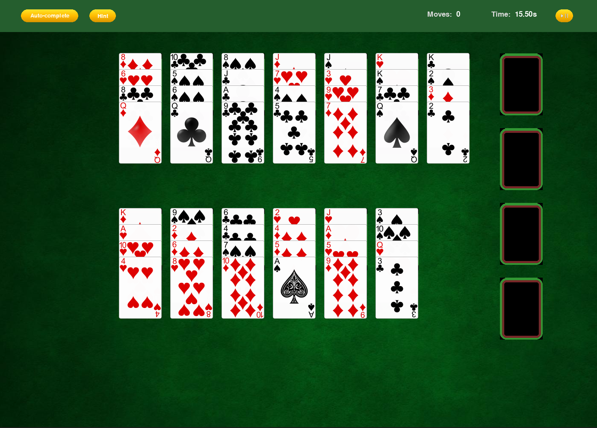
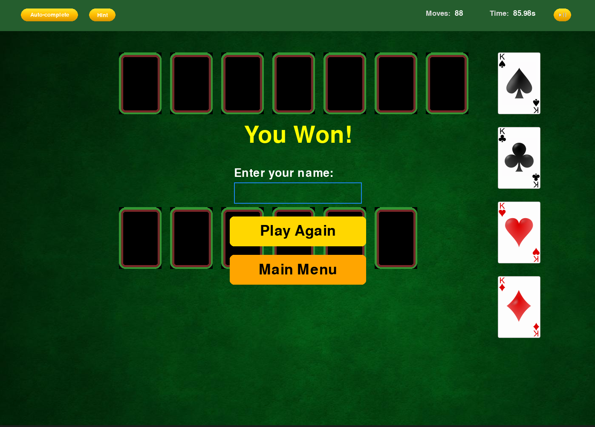

# Backer's Dozen Solitaire

## Preview

### Main Menu


### Tableu



### Win Message



## Game definition

### Setup

- The game is played with a standard 52-card deck
- Cards are dealt into 13 columns of 4 cards each
- Kings are automatically moved to the bottom of their respective columns

### Card Movement

- Only the top card of each column can be moved
- Cards can be moved to foundations or to other tableau columns
- In the tableau, cards can be placed on cards of any suit with one higher rank
- Empty columns cannot be filled.

### Foundations

- Each foundation must be built from Ace to King in the same suit
- Foundations are built in ascending order (A, 2, 3, 4, 5, 6, 7, 8, 9, 10, J, Q, K)

### Objective

- Move all cards to the foundations to win the game
- The game is completed when all four foundations contain complete A-K sequences in each suit

## Usage

To run the game run inside the root folder:

```
python3 run.py
```

## Contributors

| Name            | e-mail                   |
| --------------- | ------------------------ |
| Diogo Faria     | up202205982@edu.fe.up.pt |
| Francisco Moura | up202208750@edu.fe.up.pt |
| Diogo Pinto     | up202205225@edu.fe.up.pt |
